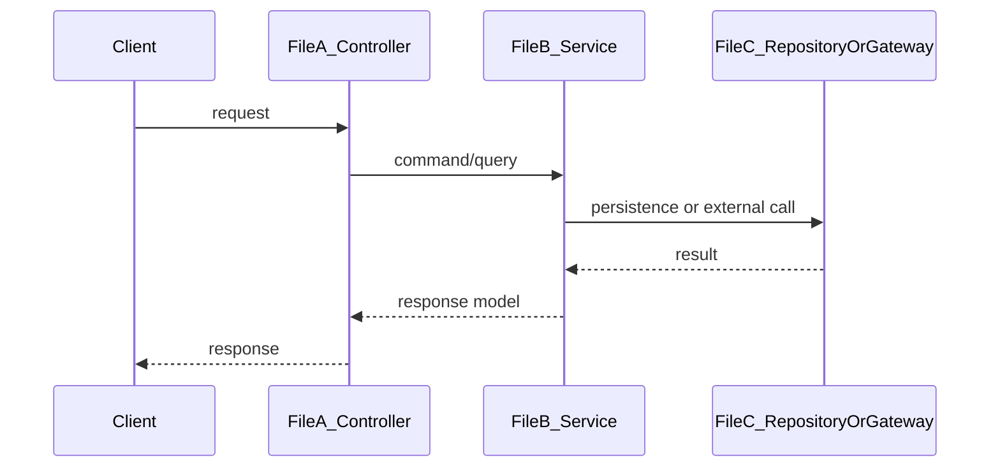
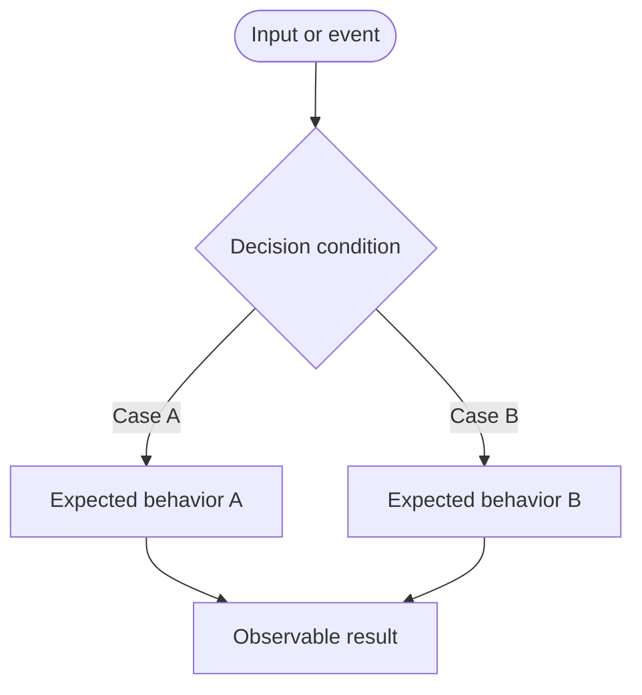

# Harness Session: {{SESSION_ID}}

## Requirement Summary

TBD

## Acceptance Criteria

- [ ] TBD

## Validation Plan

- [ ] TBD

## Implementation Guidance

TBD

### Overall Flow

### Implementation Sketch

TBD

### Decision Flow

### Code Anchors

TBD

## Implementation Checklist

- [ ] TBD

## Planning Approval

TBD

## Review

### AI Review

TBD

### Human Review

TBD

### Required Fixes

- [ ] TBD

## Quality Check

### Commands Run

TBD

### Proof

- [ ] TBD

### Manual Validation

TBD

## Final Approval

TBD

## Notes

TBD
