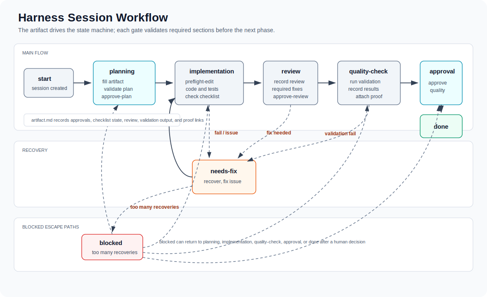

# Workflow Project Harness

Local CLI harness for agent-driven engineering workflows. It creates `.harness/` files in a repo, tracks session state in local SQLite, and gives agents guardrails for planning, implementation, review, and quality checks.

## Install

Host `install.sh` from this GitHub repo and share one bootstrap command across the team:

```bash
curl -fsSL https://raw.githubusercontent.com/hindraxxx/open-harness/main/install.sh | bash
```

If your org prefers not to pipe into `bash`, use the safer two-step version:

```bash
curl -fsSLo install.sh https://raw.githubusercontent.com/hindraxxx/open-harness/main/install.sh
bash install.sh
```

The installer:

- clones or updates the harness repo into `~/.workflow-project`
- symlinks the CLI into `~/.local/bin/harness`
- preserves the git checkout so `harness update` still works later

## Prompt An Agent To Use Harness

Ask the agent to create and drive a harness session from the target repo. Give it the source of truth, the expected scope, and whether the work stays in one repo or spans multiple repos.

For changes in one repo:

```text
Use this repo as the target repo for a new harness session.

Source of truth:
<paste a ticket, doc link, spec, or task description>

Create a new harness session, start it, read the generated guardrails, break down the work, and move through the harness workflow. Use subsessions only if the scope needs separate implementation, review, or quality-check tracks.
```

Example:

```text
https://gotocompany.sg.larksuite.com/docx/H7mudUYxloq8k3xjxiultUkCgTb

Can you get the content using lark-cli, create a new harness session in this repo, and start the breakdown? Feel free to use a session or subsessions based on the scope.
```

For changes in multiple repos:

```text
This work spans multiple repos. Create a parent harness session in the coordination repo, then create child sessions in each implementation repo that needs code changes.

Source of truth:
<paste a ticket, doc link, spec, or task description>

Repos:
- <repo path or name>: <why this repo is in scope>
- <repo path or name>: <why this repo is in scope>

For each child repo, include the parent session id, the repo-specific responsibilities, dependencies on other repos, and the validation expected before handoff. Start with the parent breakdown, then create child sessions only where the scope requires changes.
```

Example:

```text
https://gotocompany.sg.larksuite.com/docx/H7mudUYxloq8k3xjxiultUkCgTb

Can you get the content using lark-cli and coordinate this through harness?

Create a parent session in the workflow/coordination repo. If the work touches multiple repos, create child sessions in each repo that needs changes. Give each child session the parent session id, the relevant doc context, its repo-specific scope, cross-repo dependencies, and the validation it must complete before handoff.
```

Yes: for multi-repo work, give child repos their own context. The child prompt should not require the agent to infer scope from the parent session alone. Include the parent session id plus the slice of the source document that matters to that repo, the expected files or services, integration dependencies, and how success will be validated.

Useful commands:

```bash
harness list
harness next <session-id>
harness status <session-id>
harness validate <session-id>
harness preflight-edit <session-id>
harness history <session-id>
```

`harness start <session-title>` auto-initializes missing local harness files, prefixes the created session id as `YYYYMMDD_<session-title>`, and prints the canonical id to use with later commands.

HTML artifacts regenerate when you run commands such as `harness status <session-id>` or a passing `harness validate <session-id>`.

## Workflow Flow



Compact state flow:

```text
start
  -> planning
      fill/validate/approve plan
  -> implementation
      preflight-edit, code/test changes, checklist
  -> review
      AI/human review, required fixes, approval
  -> quality-check
      run validation, attach proof
  -> approval
      human quality approval
  -> done

Failures from implementation/review/quality-check go to needs-fix,
then back to implementation. Too many recoveries go to blocked.
```

## Annotate A Plan Inline

During `planning`, a human can comment directly on the rendered plan and have the agent apply the comments — all in the same session.

A passing planning validation opens the plan for review automatically:

```bash
harness validate <session-id>   # when it passes in planning, auto-opens the plan in your browser
```

This starts a lightweight local server on a random free loopback port (in the background, so `validate` does not block) and opens the rendered `artifact.html` in your default browser with an annotation layer. You can also open it yourself at any time:

```bash
harness serve <session-id> -d    # background: opens the browser and returns immediately
harness serve <session-id>       # foreground: hold the terminal until you stop it
```

Select any text in the plan, add a comment, and click **Complete** (or press Ctrl-C in foreground mode) to stop the server. Comments are saved to `.harness/sessions/<session-id>/annotations.json` (git-ignored) and survive artifact regeneration. Set `HARNESS_AUTO_SERVE=0` to disable the automatic open on validate.

Then, in the same planning chat, tell the agent to check your inline comments. The agent reads them with:

```bash
harness annotations <session-id>            # open comments, resolved to lines in artifact.md
harness annotations <session-id> --all      # include comments already addressed
harness annotations <session-id> --resolve <annotation-id>   # mark one addressed
```

The agent applies each comment by editing `artifact.md`, then marks it addressed. After the last open annotation in the batch is resolved, harness regenerates `artifact.html` and reopens the planning annotation view for another pass unless `HARNESS_AUTO_SERVE=0` is set. Only new comments surface. Inline annotations refine the plan only: they never move the workflow state, never become Required Fixes, and never authorize code edits.

## Update The CLI

From a target repo that already uses harness, update the installed harness source repo and refresh local guardrails when needed:

```bash
harness update
```

`harness update` pulls the `open-harness` repo behind the running `bin/harness`, then refreshes the target repo's guardrails and records the current CLI version in `.harness/version`.

`harness start <session-title>` checks this version too. If local guardrails are outdated it prints a warning to run `harness update`, but it does not pull code or overwrite files during session start.

- `harness sync-guardrails` remains as a deprecated compatibility alias for the local refresh part of `harness update`.
